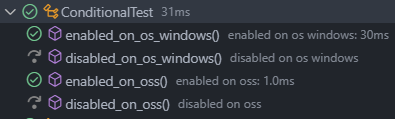

# Test Berdasarkan Kondisi

## Pengertian Test Berdasarkan Kondisi

- Sebenarnya kita bisa menggunkan Assumptions untuk menjalankan unit test berdasarkan kondisi tertentu.

- Namun JUnit menyediakan fitur yang lebih mudah untuk pengecekan beberapa kondisi, seperti kondisi sistem operasi, versi java, system property atau environtment variable.

- Ini lebih mudah dibandingkan menggunakan Assumptions

## Kondisi Sistem Operasi

- Untuk kondisi sistem operasi, kita bisa menggunakan beberapa annontation

- `@EnabledOnOs` digunakan untuk penanda bahwa unit test boleh berjalan di sistem operasi yang ditentukan.

- `@DisabledOnOs` digunakan untuk penanda bahwa unit test tidak boleh berjalan di sistem operasi yang ditentukan.

## Implementasi `@EnabledOnOs` dan `@DisabledOnOs`

`ConditionalOsTest.java`

```java
package latiha.unittesting.app;

import org.junit.jupiter.api.DisplayNameGeneration;
import org.junit.jupiter.api.DisplayNameGenerator;
import org.junit.jupiter.api.Test;
import org.junit.jupiter.api.condition.DisabledOnOs;
import org.junit.jupiter.api.condition.EnabledOnOs;
import org.junit.jupiter.api.condition.OS;

@DisplayNameGeneration(value = DisplayNameGenerator.ReplaceUnderscores.class)
class ConditionalOsTest {
  @Test
  @EnabledOnOs(value = OS.WINDOWS)
  void enabled_on_os_windows() {

  }

  @Test
  @DisabledOnOs(value = OS.WINDOWS)
  void disabled_on_os_windows() {

  }

  @Test
  @EnabledOnOs(value = { OS.WINDOWS, OS.LINUX })
  void enabled_on_oss() {

  }

  @Test
  @DisabledOnOs(value = { OS.WINDOWS, OS.LINUX })
  void disabled_on_oss() {

  }
}
```

## Hasilnya



## Kondisi Versi Java

- Untuk kondisi versi Java yang kita gunakan, kita bisa menggunakan beberaoa annontation.

- `@EnabledOnJre` digunakan untuk penanda bahwa unit test boleh berjalan di Java versi tertentu.

- `@DisabledOnJre` digunakan untuk penanda bahwa unit test tidak boleh berjalan di Java versi tertentu.

- `@EnabledForJreRange` digunakan untuk penanda bahwa unit test boleh berjalan di range Java versi tertentu.

- `@DisabledForJreRange` digunakan untuk penanda bahwa unit test tidak boleh berjalan di range Java versi tertentu.

## Implementasi `@EnabledOnJre, @DisabledOnJre, @EnableDForJreRange, @DisabledForJreRange`

``

```java
package latiha.unittesting.app;

import org.junit.jupiter.api.DisplayNameGeneration;
import org.junit.jupiter.api.DisplayNameGenerator;
import org.junit.jupiter.api.Test;
import org.junit.jupiter.api.condition.DisabledForJreRange;
import org.junit.jupiter.api.condition.DisabledOnJre;
import org.junit.jupiter.api.condition.EnabledForJreRange;
import org.junit.jupiter.api.condition.EnabledOnJre;
import org.junit.jupiter.api.condition.JRE;

@DisplayNameGeneration(value = DisplayNameGenerator.ReplaceUnderscores.class)
class ConditionalJreTest {

  @Test
  @EnabledOnJre(value = JRE.JAVA_19)
  void enabled_on_jre() {

  }

  @Test
  @DisabledOnJre(value = JRE.JAVA_19)
  void disabled_on_jre() {

  }

  @Test
  @EnabledForJreRange(min = JRE.JAVA_8, max = JRE.JAVA_19)
  void enabled_on_jre_range() {

  }

  @Test
  @DisabledForJreRange(min = JRE.JAVA_8, max = JRE.JAVA_19)
  void disabled_on_jre_range() {

  }
}
```

## Hasilnya


## Kondisi System Property

- Untuk kondisi nilai dari system property, kita bisa menggunakan beberapa annontation.

- `@EnabledIfSystemProperty` untuk penanda bahwa unit test boleh berjalan jika system property sesuai dengan yang ditentukan.

- `@DisabledIfSystemProperty` untuk penanda bahwa unit test tidak boleh berjalan jika system property sesuai dengan yang ditentukan.

- Jika kondisinya lebih dari satu, kita bisa menggunakna `@EnabledIfSystemProperties` dan `@DisabledIfSystemProperties`

## Implementasi `@EnabledIfSystemProperty, @DisabledIfSystemProperty, @EnabledIfSystemProperties, @DisabledIfSystemProperties`

`ConditionalIfSystemProperties.java`

```java
package latiha.unittesting.app;

import org.junit.jupiter.api.DisplayNameGeneration;
import org.junit.jupiter.api.DisplayNameGenerator;
import org.junit.jupiter.api.Test;
import org.junit.jupiter.api.condition.DisabledIfSystemProperties;
import org.junit.jupiter.api.condition.DisabledIfSystemProperty;
import org.junit.jupiter.api.condition.EnabledIfSystemProperties;
import org.junit.jupiter.api.condition.EnabledIfSystemProperty;

@DisplayNameGeneration(value = DisplayNameGenerator.ReplaceUnderscores.class)
class ConditionalPropertyTest {
  @Test
  @EnabledIfSystemProperty(named = "user.name", matches = "ficrihnp")
  void enabled_if_system_property() {
  }

  @Test
  @DisabledIfSystemProperty(named = "user.name", matches = "ficrihnp")
  void disabled_if_system_property() {
  }

  @Test
  @EnabledIfSystemProperties({ @EnabledIfSystemProperty(named = "user.name", matches = "ficrihnp") })
  void enabled_if_system_properties() {
  }

  @Test
  @DisabledIfSystemProperties({ @DisabledIfSystemProperty(named = "user.name", matches = "ficrihnp") })
  void disabled_if_system_properties() {
  }
}
```

## Hasilnya


## Kondisi Environment Variable

- Untuk kondisi nilai dari environment variable, kita bisa menggunakan beberapa annontation

- `@EnabledIfEnvironmentVariable` untuk penanda bahwa unit test boleh berjalan jika environment variable sesuai dengan yang ditentukan

- `DisabledIfEnvironmentVariable` untuk penanda bahwa unit test tidak boleh berjalan jika environment variable sesuai dengan yang ditentukan.

- Jika kondisinya lebih dari satu, kita bisa menggunakan `@EnabledIfEnvironmentVariables` dab `@DisabledIfEnvironmentVariables`.

## Implementasi `@EnabledIfEnvironmentVariable, @DisabledIfEnvironmentVariable, @EnabledIfEnvironmentVariables, @DisabledIfEnvironmentVariables`

`ConditionalEnvironmentTest.java`

```java
package latiha.unittesting.app;

import org.junit.jupiter.api.DisplayNameGeneration;
import org.junit.jupiter.api.DisplayNameGenerator;
import org.junit.jupiter.api.Test;
import org.junit.jupiter.api.condition.DisabledIfEnvironmentVariable;
import org.junit.jupiter.api.condition.DisabledIfEnvironmentVariables;
import org.junit.jupiter.api.condition.EnabledIfEnvironmentVariable;
import org.junit.jupiter.api.condition.EnabledIfEnvironmentVariables;

@DisplayNameGeneration(value = DisplayNameGenerator.ReplaceUnderscores.class)
class ConditionalEnvirontmentTest {

  @Test
  @EnabledIfEnvironmentVariable(named = "PROCESSOR_LEVEL", matches = "23")
  void enabled_if_environment_variable() {
  }

  @Test
  @DisabledIfEnvironmentVariable(named = "PROCESSOR_LEVEL", matches = "23")
  void disabled_if_environment_variable() {
  }

  @Test
  @EnabledIfEnvironmentVariables({
      @EnabledIfEnvironmentVariable(named = "PROCESSOR_LEVEL", matches = "23")
  })
  void enabled_if_environment_variables() {
  }

  @Test
  @DisabledIfEnvironmentVariables({
      @DisabledIfEnvironmentVariable(named = "PROCESSOR_LEVEL", matches = "23")
  })
  void disabled_if_environment_variables() {
  }

}

```

## Hasilnya


