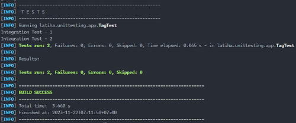

# Menggunakan `@Tag`

## Pengertian `@Tag`

- Class atau function unit test bisa kita tambahkan tag (tanda) degan menggunakan annontation `@Tag`.

- Dengan menambahkan tag ke dalam unit test, kita bisa fleksibel ketika menjalan unit test di dalam class tersebut akan memiliki tag tersebut.

- Jika kita ingin menambahkan beberapa tag di satu atau function unit test di dalam class tersebut akan memiliki tag tersebut.

- Jika kita ingin menambahkan beberapa tag di satu class atau function unit test, kita bisa menggunakan annontation `@Tag`

## Implementasi `@Tag`

`test/TagTest.java`

```java
package latiha.unittesting.app;

import org.junit.jupiter.api.DisplayNameGeneration;
import org.junit.jupiter.api.DisplayNameGenerator;
import org.junit.jupiter.api.Tag;
import org.junit.jupiter.api.Tags;
import org.junit.jupiter.api.Test;

@DisplayNameGeneration(DisplayNameGenerator.ReplaceUnderscores.class)
@Tags({
    @Tag("integration-test")
})
class TagTest {

  @Test
  void sample_integration_test_1() {
    System.out.println("Integration Test - 1");
  }

  @Test
  void sample_integration_test_2() {
    System.out.println("Integration Test - 2");
  }

}
```

## Eksekusi Program

```shell
mvn test -Dgroups=integration-test
```

## Hasilnya


