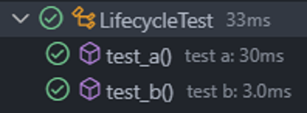
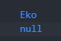
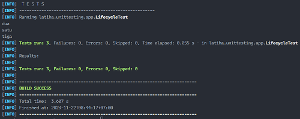
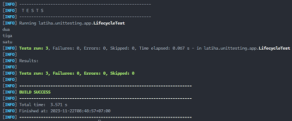

# Urutan Eksekusi Test

- Secara default, urutan eksekusi test tidak ditentukan, jadi jangan berharap jika sebuah method berada diatas method lainnya, maka akan dijalankan lebih dulu.

- Hal ini karena memang sebaiknya method unit test itu harus independen, tidak saling ketergantungan.

- Secara default pun, object class unit test akan selalu dibuat ulang tiap method, jadi jangan berharap kita bisa menyimpan data variable untuk digunakan di unit test method selanjutnya.

## Implementasi `LifecycleTest` atau Urutan Eksekusi Test

`test/LifecycleTest.java`

```java
package latiha.unittesting.app;

import org.junit.jupiter.api.DisplayNameGeneration;
import org.junit.jupiter.api.DisplayNameGenerator;
import org.junit.jupiter.api.Tag;
import org.junit.jupiter.api.Tags;
import org.junit.jupiter.api.Test;

@DisplayNameGeneration(value = DisplayNameGenerator.ReplaceUnderscores.class)
@Tags({
    @Tag("lifecycle-test")
})
class LifecycleTest {
  private String temp;

  @Test
  void test_a() {
    this.temp = "Eko";
    System.out.println(this.temp);
  }

  @Test
  void test_b() {
    System.out.println(this.temp);
  }
}

```

## Hasilnya





## Mengubah Urutan Eksekusi Test

- JUnit mendukung perubahan urutan eksekusi test jika kita mau menggunakan annontation `@TestMethodOrder`, ada beberapa cara yang bisa kita lakukan.

- `DisplayName, MethodName`, artinya urutan eksekusi unit test akan diurutkan berdasarkan alphanumeric.

- `Random,` artinya urutan eksekusi unit test akan dieksekusi secara random.

- `OrderAnnontation`, artinya urutan eksekusi unit test akan mengikuti annontation `@Order` yang ada di tiap method unit test.

## Implementasi `@TestMethodOrder, OrderAnnontation`

`test/LifecycleTest.java`

```java
package latiha.unittesting.app;

import java.lang.reflect.Method;

import org.junit.jupiter.api.DisplayNameGeneration;
import org.junit.jupiter.api.DisplayNameGenerator;
import org.junit.jupiter.api.MethodOrderer;
import org.junit.jupiter.api.Order;
import org.junit.jupiter.api.Tag;
import org.junit.jupiter.api.Tags;
import org.junit.jupiter.api.Test;
import org.junit.jupiter.api.TestMethodOrder;

@Tags({
    @Tag("lifecycle-test")
})
@DisplayNameGeneration(value = DisplayNameGenerator.ReplaceUnderscores.class)
@TestMethodOrder(value = MethodOrderer.OrderAnnotation.class)
class LifecycleTest {

  @Test
  @Order(1)
  void test_1() {
    System.out.println("satu");
  }

  @Test
  @Order(3)
  void test_2() {
    System.out.println("dua");
  }

  @Test
  @Order(2)
  void test_3() {
    System.out.println("tiga");
  }
}

```

## Hasilnya


## Implementasi `@TestMethodOrder, DisplayName`

`test/LifecycleTest.java`

```java
package latiha.unittesting.app;

import org.junit.jupiter.api.DisplayNameGeneration;
import org.junit.jupiter.api.DisplayNameGenerator;
import org.junit.jupiter.api.MethodOrderer;
import org.junit.jupiter.api.Tag;
import org.junit.jupiter.api.Tags;
import org.junit.jupiter.api.Test;
import org.junit.jupiter.api.TestMethodOrder;

@Tags({
    @Tag("lifecycle-test")
})
@DisplayNameGeneration(value = DisplayNameGenerator.ReplaceUnderscores.class)
@TestMethodOrder(value = MethodOrderer.DisplayName.class)
class LifecycleTest {

  @Test
  void b_test_1() {
    System.out.println("satu");
  }

  @Test
  void a_test_2() {
    System.out.println("dua");
  }

  @Test
  void c_test_3() {
    System.out.println("tiga");
  }
}
```

## Hasilnya



## Implementasi `@TestMethodOrder, Random`

`test/LifecycleTest.java`

```java
package latiha.unittesting.app;

import org.junit.jupiter.api.DisplayNameGeneration;
import org.junit.jupiter.api.DisplayNameGenerator;
import org.junit.jupiter.api.MethodOrderer;
import org.junit.jupiter.api.Tag;
import org.junit.jupiter.api.Tags;
import org.junit.jupiter.api.Test;
import org.junit.jupiter.api.TestMethodOrder;

@Tags({
    @Tag("lifecycle-test")
})
@DisplayNameGeneration(value = DisplayNameGenerator.ReplaceUnderscores.class)
@TestMethodOrder(value = MethodOrderer.Random.class)
class LifecycleTest {

  @Test
  void test_1() {
    System.out.println("satu");
  }

  @Test
  void test_2() {
    System.out.println("dua");
  }

  @Test
  void test_3() {
    System.out.println("tiga");
  }
}
```

## Hasilnya




