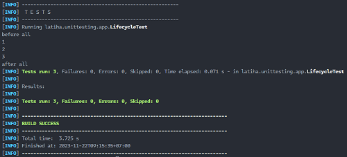

# Siklus Hidup Test

## Pengertian Siklus Hidup Test

- Secara default, lifecycle (siklus hidup) object test adalah independent per method test, artinya object unit test akan selalu dibuat baru per method unit test, oleh karena itu kita tidak bisa bergantung dengan method test lain.

- Cara pembuatan object test di JUnit ditentukan oleh annontation `@TestInstance` dimana defaultnya adalah `Lifecycle.PER_METHOD`, artinya tiap method akan dibuat sebuah instance / object baru.

- Kita bisa merubahnya menjadi Lifecycle.PER_CLASS jika mau, dengan demikian instance / object test hanya dibuat sekali per class, dan method test akan menggunakan object test yang sama.

- Hal ini bisa kita manfaatkan ketika membuat test yang tergantung dengan test lain.

## Implementasi `@TestInstance(TestInstance.Lifecycle.PER_METHOD)`

`test/LifecycleTest.java`

```java
package latiha.unittesting.app;

import org.junit.jupiter.api.DisplayNameGeneration;
import org.junit.jupiter.api.DisplayNameGenerator;
import org.junit.jupiter.api.Tag;
import org.junit.jupiter.api.Tags;
import org.junit.jupiter.api.Test;
import org.junit.jupiter.api.TestInstance;

@Tags({
    @Tag("lifecycle-test")
})
@DisplayNameGeneration(value = DisplayNameGenerator.ReplaceUnderscores.class)
@TestInstance(TestInstance.Lifecycle.PER_METHOD)
class LifecycleTest {
  private int counter;

  @Test
  void test_1() {
    counter++;
    System.out.println(this.counter);
  }

  @Test
  void test_2() {
    counter++;
    System.out.println(this.counter);
  }

  @Test
  void test_3() {
    counter++;
    System.out.println(this.counter);
  }
}

```

## Hasilnya


## Implementasi `@TestInstance(TestInstance.Lifecycle.PER_CLASS)`

`test/LifecycleTest.java`

```java
package latiha.unittesting.app;

import org.junit.jupiter.api.DisplayNameGeneration;
import org.junit.jupiter.api.DisplayNameGenerator;
import org.junit.jupiter.api.Tag;
import org.junit.jupiter.api.Tags;
import org.junit.jupiter.api.Test;
import org.junit.jupiter.api.TestInstance;

@Tags({
    @Tag("lifecycle-test")
})
@DisplayNameGeneration(value = DisplayNameGenerator.ReplaceUnderscores.class)
@TestInstance(TestInstance.Lifecycle.PER_CLASS)
class LifecycleTest {
  private int counter;

  @Test
  void test_1() {
    counter++;
    System.out.println(this.counter);
  }

  @Test
  void test_2() {
    counter++;
    System.out.println(this.counter);
  }

  @Test
  void test_3() {
    counter++;
    System.out.println(this.counter);
  }
}

```

## Hasilnya


## Keuntungan Instance Per Class

- Salah satu keuntunga saat menggunakan Lifecycle.PER_CLASS adalah, kita bisa menggunakan `@BeforeAll` dan `@AfterAll` di method biasa, tidak harus menggunakan function object / static.

## Implementasi `@BeforeAll, @AfterAll`

`test/Lifecycle.java`

```java
package latiha.unittesting.app;

import org.junit.jupiter.api.AfterAll;
import org.junit.jupiter.api.BeforeAll;
import org.junit.jupiter.api.DisplayNameGeneration;
import org.junit.jupiter.api.DisplayNameGenerator;
import org.junit.jupiter.api.Tag;
import org.junit.jupiter.api.Tags;
import org.junit.jupiter.api.Test;
import org.junit.jupiter.api.TestInstance;

@Tags({
    @Tag("lifecycle-test")
})
@DisplayNameGeneration(value = DisplayNameGenerator.ReplaceUnderscores.class)
@TestInstance(TestInstance.Lifecycle.PER_CLASS)
class LifecycleTest {
  private int counter;

  @BeforeAll
  void before_all() {
    System.out.println("before all");
  }

  @AfterAll
  void after_all() {
    System.out.println("after all");
  }

  @Test
  void test_1() {
    counter++;
    System.out.println(this.counter);
  }

  @Test
  void test_2() {
    counter++;
    System.out.println(this.counter);
  }

  @Test
  void test_3() {
    counter++;
    System.out.println(this.counter);
  }
}
```

## Hasilnya


