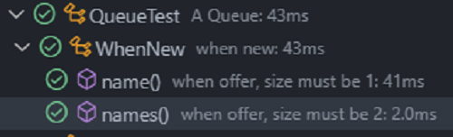

# Test di dalam Test

## Pengertian Test di dalam Test

- Saat membuat unit test, ada baiknya ukuran test class nya tidak terlalu besar karena akan sulit di baca dan dimengerti.

- Jika test class sudah semakid besar, ada baiknya kita pecah menjadi beberapa test class, lalu kita grouping sesuai dengan jenis method test nya.

- JUnit mendukung pembuatan class test di dalam class test, jadi kita bisa memecah sebuah class test, tanpa harus membuat class di file berbeda, kita bisa cukup menggunakan inner class.

- Untuk memberi tahu bahwa inner class tersebut adalah test class, kita bisa menggunakan annontation `@Nested`.


## Implementasi `@Nested`

`test/QueueTest.java`

```java
  package latiha.unittesting.app;

  import static org.junit.jupiter.api.Assertions.assertEquals;

  import java.util.LinkedList;
  import java.util.Queue;

  import org.junit.jupiter.api.BeforeEach;
  import org.junit.jupiter.api.DisplayName;
  import org.junit.jupiter.api.Nested;
  import org.junit.jupiter.api.Test;

  @DisplayName("A Queue")
  public class QueueTest {
    private Queue<String> queue;

    @DisplayName("when new")
    @Nested
    class WhenNew {

      @BeforeEach
      void setUp() {
        queue = new LinkedList<>();
      }

      @Test
      @DisplayName("when offer, size must be 1")
      void name() {
        queue.offer("Ficri");
        assertEquals(1, queue.size());
      }

      @Test
      @DisplayName("when offer, size must be 2")
      void names() {
        queue.offer("Ficri");
        queue.offer("Hanip");
        assertEquals(2, queue.size());
      }
    }
  }

```

## Hasilnya


