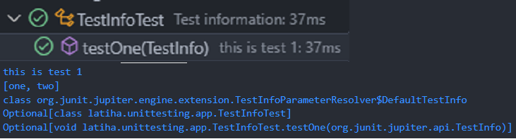

# Informasi Test

## Pengertian Informasi Test

- Walaupun mungkin jarang kita gunakan, tapi kita juga bisa mendapatkan informasi test yang sedang berjalan menggunakan interface TestInfo.

- Kita bisa menambahkan TestInfo sebagai parameter di function unit test.

## Implementasi `TestInfo`

`test/TestInfoTest.java`

```java
package latiha.unittesting.app;

import org.junit.jupiter.api.DisplayName;
import org.junit.jupiter.api.Tag;
import org.junit.jupiter.api.Tags;
import org.junit.jupiter.api.Test;
import org.junit.jupiter.api.TestInfo;

@DisplayName("Test information")
class TestInfoTest {

  @Test
  @Tags({
      @Tag("one"), @Tag("two")
  })
  @DisplayName("this is test 1")
  void testOne(TestInfo testInfo) {
    System.out.println(testInfo.getDisplayName());
    System.out.println(testInfo.getTags());
    System.out.println(testInfo.getClass());
    System.out.println(testInfo.getTestClass());
    System.out.println(testInfo.getTestMethod());
  }
}
```

## Hasilnya




