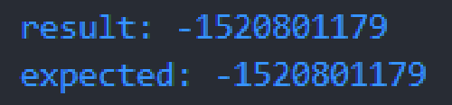

# Dependency Injection di Test

- Tidak ada magic di JUnit, sebenarnya fitur TestInfo yang sebelumnya kita bahas adalah bagian dari dependency injection di JUnit.

- Dependency Injection sederhananya adalah bagaimana kita bisa memasukan dependency (object/instance) ke dalam unit test secara otomatis tanpa proses manual.

- Saat kita menambah parameter di function unit test, sebenarnya kita bisa secara otomatis memasukan parameter tersebut dengan bantuan ParameterResolver

- Contohnya `TestInfo` yang kita bahas sebelumnya, sebenarnya objectnya dibuat oleh `TestInfoParameterResolver`.

## Implementasi `parameter resolver`

`test/resolver/RandomParameterResolver.java`

```java
package latiha.unittesting.app.resolver;

import java.util.Random;

import org.junit.jupiter.api.extension.ExtensionContext;
import org.junit.jupiter.api.extension.ParameterContext;
import org.junit.jupiter.api.extension.ParameterResolutionException;
import org.junit.jupiter.api.extension.ParameterResolver;

public class RandomParameterResolver implements ParameterResolver {
  private Random random = new Random();

  @Override
  public Object resolveParameter(ParameterContext parameterContext, ExtensionContext extensionContext)
      throws ParameterResolutionException {
    return this.random;
  }

  @Override
  public boolean supportsParameter(ParameterContext parameterContext, ExtensionContext extensionContext)
      throws ParameterResolutionException {
    return parameterContext.getParameter().getType() == Random.class;
  }

}
```

## Menggunakan Parameter Resolver

- Untuk menggunakan parameter resolver yang sudah kita buat, kita bisa menggunakan annontation `@ExtendWith` di test class.

- Jika lebih dari 1 parameter resolver, kita bisa menggunakan `@Extensions`

## Implementasi `@ExtendWith` dan `@Extensions`

`test/RandomCalculatorTest.java`

```java
package latiha.unittesting.app;

import static org.junit.jupiter.api.Assertions.assertEquals;

import java.util.Random;

import org.junit.jupiter.api.Test;
import org.junit.jupiter.api.extension.ExtendWith;
import org.junit.jupiter.api.extension.Extensions;

import latiha.unittesting.app.resolver.RandomParameterResolver;

@Extensions({
    @ExtendWith(RandomParameterResolver.class)
})
class RandomCalculatorTest {
  private Calculator calculator = new Calculator();

  @Test
  void test_add(Random random) {
    int a = random.nextInt();
    int b = random.nextInt();
    int result = this.calculator.add(a, b);
    int expected = a + b;
    assertEquals(expected, result);
    System.out.println("result: " + result);
    System.out.println("expected: " + expected);
  }
}

```

## Hasilnya



